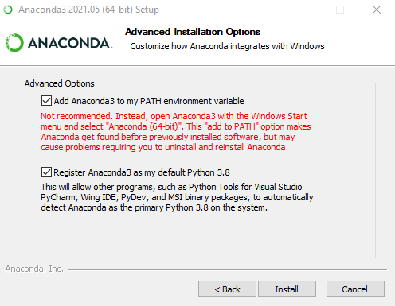

Installation
============

Installation has only been tested under windows 10 x64, but it should be possible to adapt it to Linux or MacOS.

Requirements: At least 2gb of free space

Anaconda
********

Anaconda is required for this software. If you haven’t already, visit the official `website <https://anaconda.org/>`_ and download the latest ``*.exe`` installation file for Python 3.x.

-	Once the download completes, open and run the .exe installer.
-   Follow the instructions, and in the advanced options, tick the Path checkbox.

   Tick both options here. If not possible, please add python to path manually

-   Once your installation is completed, reboot your computer.

Installation
************

Warning: You need a fast and reliable internet connection during this operation

Download the latest installer from the release page on Github : `Latest release <https://github.com/marinmarcillat/CHUBACAPP/releases/latest>`_

Run the installer

What it does:
This configures a python environment with the right Python libraries to run all the program (according to the environment.yml file). This chubacapp environment will be accessible for advanced users and debugging.
The installer also creates a shortcut to run Chubacapp, and an uninstaller.
