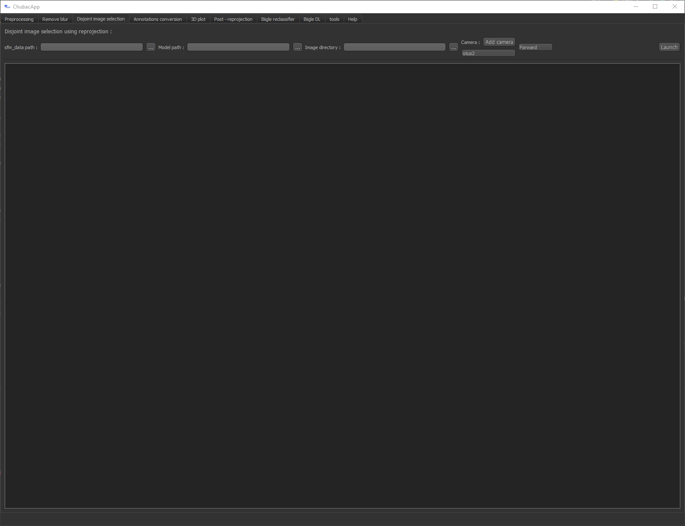

Using the app
=============

Launching
*********

The easy way
------------

Use the shortcut created during the installation phase

The advanced way
----------------

Launch the ``main.py`` file using a python IDE (PyCharm or equivalent) and the chubacapp python environment (for debugging).

.. _preprocessing:

Preprocessing
*************

.. figure:: images/preprocessing.png
   :scale: 75 %
   :alt: preprocessing tab

   The preprocessing tab

Prepare the dives for preprocessing with Matisse Preprocessing. It:

-	Groups multiple navigation dim2 files
-	Correct the navigation using the .txt reference navigation file (optional)
-   Correct the navigation using the optical navigation from the 3D reconstruction
-	Copy the image from each acquisition files (optional)

The newly created file is stored in the output directory, along with (eventual) images.

If the input directory consists in multiple acquisition directories, all navigation files from each of them are concatenated.

*Input*

-	Directory were the dim2 is located or where multiple subfiles containing dim2 files are located. These dim2 files *MUST* start with ``acq_``, as in typical ifremer acquisitions files.
-	Reference positions: a ``.txt`` file containing reference lat long. See the Matisse preprocessing manual for more information.
-	sfm_data: see See :ref:`this section <sfm data>` for more information.
-	output directory: where to store the new navigation file 
-	Nav name: exported navigation name
-	Copy images: will copy all images from acquisition subdirs to output directory

*Output*

-	a unique, eventually corrected ``.dim2`` navigation file, ready for Matisse3D.

.. _remove blur:

Removing blur
*************

.. figure:: images/remove_blur.png
   :scale: 75 %
   :alt: remove blur tab

   The blur removal tab

Detection and removal of blurry images, and removal from the ``*.dim2`` nav file. It uses the variance of the Laplacian to get the amount of blur of images, and then filter outliers using a student t test. It’s based on Adrian Rosebrock fast Fourier transform algorithm (link needed).

The algorithm will evaluate a blur value for each image and store it in a ``*.csv`` file. This can take a while.

Then the user can choose the alpha level to eliminate the blurriest images. The percentage of image to be discarded is indicated. The deleted images will be transferred to a trash directory.

If le blur evaluation phase has already been done, you can provide the csv to skip the (heavy) calculation step.

*Input*

-   A directory containing images.
-   An alpha value for the outliers selection

*Output*

-   The same directory, with a trash subdirectory were the discarded images are stored

.. _disjoint image selection:

Disjoint image selection
************************

   The Disjoint image selection tab

This algorithm will, for every image in the image directory, evaluate it's imprint on the 3D model using reprojection,
evaluate contacts between these imprints and use these to select images without overlaps.

Two methods are available for disjoint image selection:
-   Forward: Starting from the first image, add the first next image that is not in contact with the previous selected one. Fast
-   Permutations: Starting with a all images selected, remove iteratively the image that have most contacts. Slow but highest surface covered

These selected image will be copied in a separate output directory, and are ready to annotate.

*Input*

-   An sfm_data.bin or sfm_data.json(faster) path. See :ref:`this section <sfm data>` for more information. Important: for this sfm, please do not use the filtered temp_sfm_data.json.
-   A ``.ply`` model path
-   An image directory
-   A camera model.
-   The method (Forward or permutations)

*Output*

-   In the image directory, an output directory containing all selected images
-   The 3D models of the selected images imprints to check overlaps.

Biigle interfacing
******************

The following widgets feature a Biigle connection interface. Just fill in your credentials (email and API token) and click Connect. This allows to:

-	Input annotations directly to Biigle (see Deep Learning)
-	Grab images or miniatures from Biigle volumes

You can generate your Biigle token in your account on the `Biigle webpage <https://biigle.ifremer.fr/settings/tokens>`_.

In the tools tab, you will be able to set your project and volume index. You can find these in your internet navigator's bar
when you open your Biigle volume.

You might also need to adapt your Biigle instance (default is biigle.ifremer.fr). For now, this is hardcoded in the CHUBACAPP/biigle/biigle.py

Deep Learning
*************

Auto detection of features on images using yoloV5 deep learning algorithms. The user needs to feed a trained model.
Annotations can be exported through:
-	Biigle: directly added to your Biigle project
-	PascalVOC: standard file protocol for annotation

You can filter annotations based on your chosen confidence level.

*This feature is still under work and will be significantly modified in the future.*

Annotation conversion
*********************

.. figure:: images/annotations_conversion.png
   :scale: 75 %
   :alt: annotation conversion tab

   The annotation conversion tab

This allows to convert annotations on 2D images to georeferenced 2D annotations or georeferenced 3D annotations. These annotations can be objects annotations or image labels. The annotation report file is a ``*.csv`` coming from Biigle. Please make sure to select the correct mode (annotation/label).

Geolocalisation
---------------

The 2D algorithm converts Biigle annotations to 2D annotations using corresponding geotiff from Matisse3D software. It uses features matching to get a homographic matrix, then use it to convert annotations coordinates. It has proven to be less precise than 3D reprojection.

.. _reprojection:

Reprojection
------------

The annotations are re-projected onto the 3D model using the camera position and rotation information from the 3D model and the intrinsic characteristics of the camera. This information is located in a sfm_data.bin file generated by Matisse 3D (see sfm data). 
For the reprojection, the cameras were simulated using the Blender python library (Blender Community, 2018) and the image pixels projected onto the 3D model using ray tracing. The local coordinates of the annotations (in pixels, 2D) were thus transformed into global coordinates (geo-referenced, 3D). The footprint of each images on the 3D model is also determined. 

The 3D algorithm reprojects annotations from a Biigle csv export file on a 3D (``*.ply``) model.

Along with the annotation, a "bound" polygon annotation, corresponding to the image imprint reprojection, is created for each annotated image.

It can be exported as a shapefile (warning: you will lose of the 3D information) or using the 3DMetrics json pattern.

*Input*

-   Biigle ``.csv`` report.
-   ``.ply`` 3D model.
-   sfm_data.bin or sfm_data.json(faster) path. See :ref:`this section <sfm data>` for more information.
-   Export type. ``.shp`` or 3D metrics ``.json``
-   Model origin ``.txt`` file
-   Camera model

*Output*

-   shp: For each type of annotation (point and circle, line, polygon), a specific ``.shp`` file with the reprojected annotations
-   json: for point (points and circle) and polygons annotations, a specific ``.json`` file with the reprojected annotations
-   labels: a ``.shp`` or a ``.json`` containing reprojected image imprint with corresponding label

**Videos**

For Videos, the reprojection is done for every frames of the annotation.

*Input*

-   video (``.mp4`` or ``.avi``)
-   Image directory containing the images used for the reconstruction
-   Time interval for image extraction in Matisse Preprocessing

3D annotations plotting
***********************

.. figure:: images/plot3d.png
   :scale: 75 %
   :alt: 3D plot tab

   The 3D plotting tab

Plot your 3D annotations !

Post-reprojection
*****************

This widget allows you to filter annotations to avoid redundancy due to image overlap. It does so by joining overlapping polygons, and, if one point annotation is present on two or more image imprints, by keeping only one.

It also allows to homogenize annotations (based on a configuration file).

The structure of this ``*.csv`` configuration file follows typically this structure:

.. figure:: images/conf_file.png
   :scale: 75 %
   :alt: conf file

   Example configuration disposition

Where the first column corresponds to the annotation name, the third to its shape (other annotations shape will be converted, using polygon centroid for polygon to point or by creating a circle for points to polygon).

The input path is a directory containing the polygon and the point annotations under the name polygon.shp and point.shp. The output path must be a directory.

Topographic metrics
*******************

This widget allows you to compute 3D topographic metrics using Cloud compare.
It can compute slope, aspect (slope direction), roughness, Gaussian curvature, mean curvature, Benthic Positional Index (BPI) and Topographic Roughness Index (TRI).

For BPI and TRI computation, we use custom algorithms derived from Wilson et al., 2007:

.. math::
    TRI_{(n)}=\frac{\sum_{i=0}^{N}|Z_i-Z|}{N-1}

.. math::
    BPI_{(n)}=Z - \frac{\sum_{i=0}^{N}Z_i}{N}

Where n is the given scale, N  the number of neighbors within the scale radius from the studied point, Z the elevation above the fitted plane of the studied point and Z_i the elevation above the fitted plane of neighbor i.

*Input*

-   ``.ply`` 3D model
-   An output directory path
-   The metrics you want to compute
-   The different scales in meters, separated by a comma

*Output*

-   A ``.pcd`` point cloud data with a Scalar field (SF) for each topographic metric. You can visualize it in Cloud Compare.

.. _sfm data:

Quick guide to Matisse3D outputs and the sfm_data files
*******************************************************

When you reconstruct a 3D model using Matisse3D, you will be provided the following folder structure (you can find it the example data):

::

    $ outReconstruction
    ├── temp
    │ ├── ModelPart_0
    │ │ ├── sfm_data.bin
    │ │ └── ...
    │ ├── ModelPart_1     (if more than one 3D model is produced)
    │ └── ...
    ├── MyProcessing_0_mesh.ply
    ├── MyProcessing_0_texrecon.obj
    ├── MyProcessing_0_texrecon.mtl     (associated to .obj)
    ├── MyProcessing_0_texrecon_material0000_map_Kd.png     (texture file for .obj)
    └── model_origin.txt     (geographic origin of the 3D model)

The ``.ply`` and ``.obj`` are the same 3D model, but the ``.obj`` is textured.

The sfm_data.bin contain the 3D positions and atitudes reconstituted during the reconstruction step. 
The chubacarc software will systematically extract the sfm_data.bin file to a much more usable (but bigger) sfm_data.json file.
This sfm_data.json contains many unecessary informations. It will thus be filtered to only contain required camera positions and some camera parameters.
This filtered sfm is stored as a temp_sfm_data.bin.

In the Chubacapp software, when a sfm file is required, you can provide any of (from slowest to fastest) sfm_data.bin, sfm_data.json or temp_sfm_data.bin.
Please be aware that if you add or remove images during the pipeline, you might be required to provide the sfm_data.json for the program to filter it again.

For developers
***************

Compiling the installer
-----------------------

The installer is created using NSIS. Install it, and install the following plugins:

-   Locate
-   FileFunc
-   LogicLib
-   inetc
-   Nsis7z
-   nsExec
