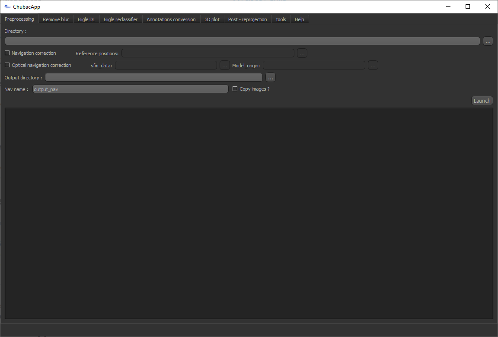
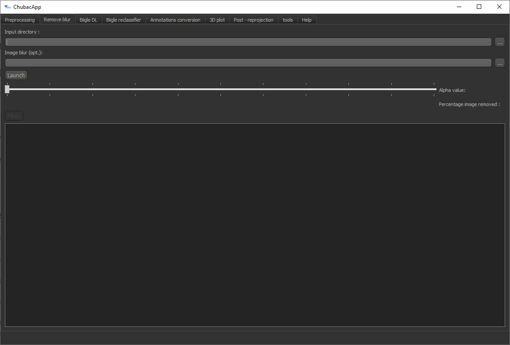
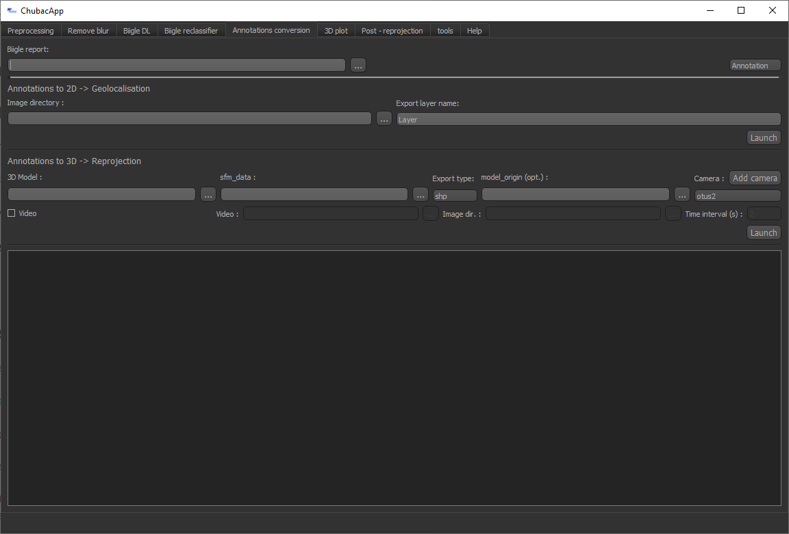
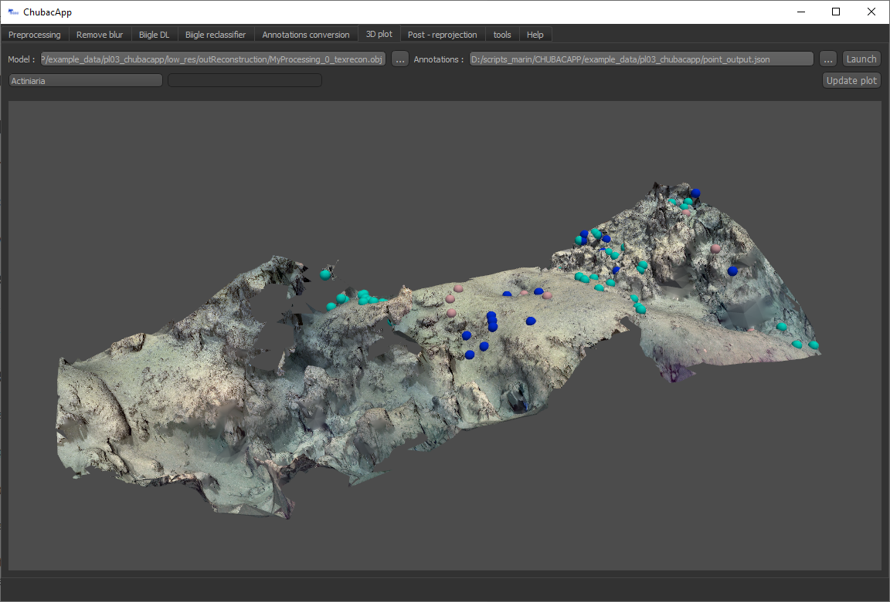
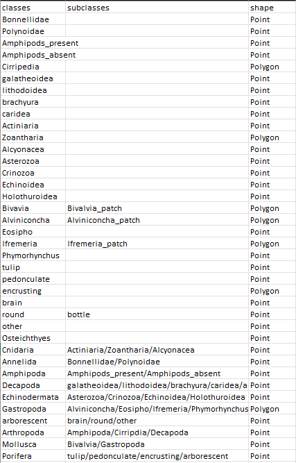

Using the app
=============

Launching
*********

The easy way
------------

Launch (double click) the ``launch_app.bat`` command file.

What it does: It will launch the main python script in the Conda environment we just created

The advanced way
----------------

Launch the ``main.py`` file using a python IDE (PyCharm or equivalent) and the chubacapp python environment (for debugging).

Preprocessing
*************

   The preprocessing tab

Prepare the dives for preprocessing with Matisse Preprocessing. It:

-	Groups multiple navigation dim2 files
-	Correct them using the .txt reference navigation file (optional)
-	Copy the image (optional)

The newly created file is stored in the output directory, along with (eventual) images.

If the input directory consists in multiple acquisition directories, all navigation files from each of them are concatenated.

Input
^^^^^

Output
^^^^^^

Removing blur
*************

   The blur removal tab

Detection and removal of blurry images, and removal from the ``*.dim2`` nav file. It uses the variance of the Laplacian to get the amount of blur of images, and then filter them using student t test. It’s based on Adrian Rosebrock fast Fourier transform algorithm (link needed).

First feed the image directory, and then launch. The algorithm will evaluate a blur value for each image and store it in a csv file. This can take a while.

Then the user can choose the alpha level to eliminate the blurriest images. The deleted images will be transferred to a bin directory.

If le blur evaluation phase has already been done, you can provide the csv to skip the (heavy) calculation step.

Biigle interfacing
******************

The following widgets feature a Biigle connection interface. Just fill in your credentials (email and API token) and click Connect. This allows to:

-	Input annotations directly to Biigle (see Deep Learning)
-	Grab images or miniatures from Biigle volumes

Deep Learning
*************

Auto detection of features on images using yoloV5 deep learning algorithms. The user needs to feed a trained model.
Annotations can be exported through:
-	Biigle: directly added to your Biigle project
-	PascalVOC: standard file protocol for annotation

You can filter annotations based on your chosen confidence level.

*This feature is still under work and will be significantly modified in the future.*

Annotation conversion
*********************

   The annotation conversion tab

This allows to convert annotations on 2D images to georeferenced 2D annotations or georeferenced 3D annotations. These annotations can be objects annotations or image labels. The annotation report file is a ``*.csv`` coming from Biigle. Please make sure to select the correct mode (annotation/label).

Geolocalisation
---------------

The 2D algorithm converts Biigle annotations to 2D annotations using corresponding geotiff from Matisse3D software. It uses features matching to get a homographic matrix, then use it to convert annotations coordinates. It has proven to be less precise than 3D reprojection.

Reprojection
------------

The 3D algorithm reprojects annotations from a Biigle csv export file on a 3D (``*.ply``) model. It uses the camera position extracted from the sfm_data file obtained during the photogrammetric reconstruction. It can be exported as a shapefile (lose of the 3D information) or using the 3DMetrics protocol.

**Videos**

3D annotations plotting
***********************

   The 3D plotting tab

Post-reprojection
*****************

This widget allows you to filter annotations to avoid redundancy due to image overlap. It does so by joining overlapping polygons, and, if one point annotation is present on two or more image imprints, by keeping only one.

It also allows to homogenize annotations (based on a configuration file).

The structure of this ``*.csv`` configuration file follows typically this structure:

   Example configuration disposition

Where the first column corresponds to the annotation name, the third to its shape (other annotations shape will be converted, using polygon centroid for polygon to point or by creating a circle for points to polygon).

The input path is a directory containing the polygon and the point annotations under the name polygon.shp and point.shp. The output path must be a directory.

